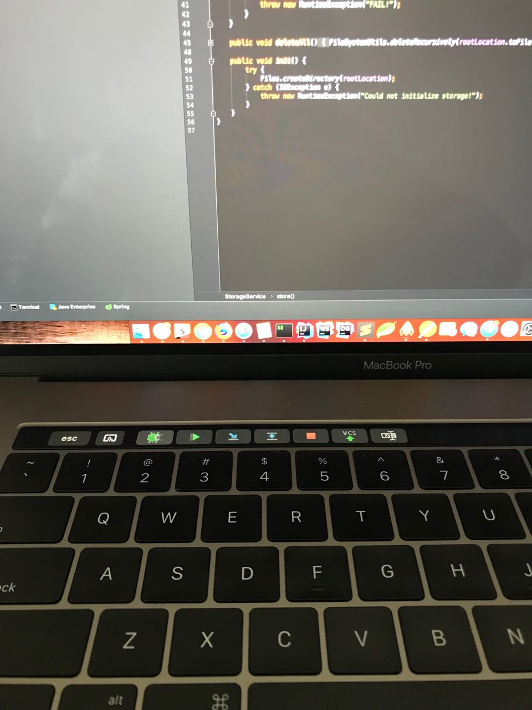

# intellij-touchbar
Intellij Idea config file for BTT(Better Touch Tool)

### How to 
* make sure you have BTT & IntelliJ Idea installed 
* import the `intellij-btt-touchbar.json` into BTT via  *Manage Presets* 

#### what your touch bar will look like

